# Analytics and Event Tracking Flow

## Description

Comprehensive analytics system including user behavior tracking, performance monitoring, and business intelligence.

## Key Files

- `src/utils/analytics/track.ts`
- `src/utils/analytics/identify.ts`
- `src/lib/posthog-client.ts`
- `src/utils/honeycomb-tracer.ts`
- `src/components/monitoring/performance-monitor.tsx`

## Trigger Points

- User interactions and page views
- Video playback events
- Purchase and subscription events
- Error occurrences and performance issues

## Mermaid Diagram

```mermaid
flowchart TD
    A[User Action/Event] --> B{Event Category}

    B -->|Page View| C[Page Analytics]
    B -->|User Interaction| D[Behavior Analytics]
    B -->|Video Playback| E[Video Analytics]
    B -->|Purchase/Subscribe| F[Conversion Analytics]
    B -->|Performance| G[Performance Analytics]
    B -->|Error| H[Error Analytics]

    C --> I[Collect Page Data]
    I --> J[URL, Referrer, User Agent]
    J --> K[Session Information]
    K --> L[User Demographics]
    L --> M[Send to PostHog]

    D --> N{Interaction Type}
    N -->|Click| O[Button/Link Tracking]
    N -->|Form| P[Form Interaction Tracking]
    N -->|Search| Q[Search Analytics]
    N -->|Navigation| R[Menu/Navigation Usage]

    O --> S[Element Identification]
    S --> T[Context Information]
    T --> U[A/B Test Variant]
    U --> V[Send Event to PostHog]

    P --> W[Form Field Analytics]
    W --> X[Completion/Abandonment Rates]
    X --> Y[Validation Error Tracking]
    Y --> V

    Q --> Z[Query Terms]
    Z --> AA[Results Count]
    AA --> BB[Result Click-through]
    BB --> CC[Zero Results Tracking]
    CC --> V

    R --> DD[Navigation Path]
    DD --> EE[Menu Item Usage]
    EE --> FF[User Journey Mapping]
    FF --> V

    E --> GG[Video Event Processing]
    GG --> HH{Video Event Type}

    HH -->|Play| II[Playback Started]
    HH -->|Pause| JJ[Playback Paused]
    HH -->|Complete| KK[Video Completed]
    HH -->|Progress| LL[Progress Milestone]
    HH -->|Quality| MM[Quality Change]

    II --> NN[Video Metadata]
    NN --> OO[User Progress Context]
    OO --> PP[Send to PostHog + Honeycomb]

    JJ --> QQ[Pause Duration]
    QQ --> RR[Pause Reason Detection]
    RR --> PP

    KK --> SS[Completion Rate Calculation]
    SS --> TT[Engagement Score Update]
    TT --> PP

    LL --> UU[Progress Percentage]
    UU --> VV[Time-based Milestones]
    VV --> PP

    MM --> WW[Quality Level]
    WW --> XX[Bandwidth Context]
    XX --> PP

    F --> YY[Purchase Event Processing]
    YY --> ZZ{Purchase Type}

    ZZ -->|Subscription| AAA[Subscription Analytics]
    ZZ -->|One-time| BBB[Product Analytics]
    ZZ -->|Workshop| CCC[Workshop Analytics]

    AAA --> DDD[Plan Type & Price]
    DDD --> EEE[Payment Method]
    EEE --> FFF[Discount/Coupon Usage]
    FFF --> GGG[Customer Lifetime Value]
    GGG --> HHH[Revenue Attribution]

    BBB --> III[Product Category]
    III --> JJJ[Purchase Funnel Stage]
    JJJ --> KKK[Conversion Path]
    KKK --> HHH

    CCC --> LLL[Workshop Details]
    LLL --> MMM[Team Size]
    MMM --> NNN[Quote-to-Purchase Time]
    NNN --> HHH

    HHH --> OOO[Send to PostHog + Customer.io]

    G --> PPP[Performance Monitoring]
    PPP --> QQQ{Metric Type}

    QQQ -->|Core Web Vitals| RRR[CWV Collection]
    QQQ -->|API Response Time| SSS[API Performance]
    QQQ -->|Page Load Time| TTT[Page Performance]
    QQQ -->|Resource Loading| UUU[Asset Performance]

    RRR --> VVV[LCP, FID, CLS Tracking]
    VVV --> WWW[Performance Score Calculation]
    WWW --> XXX[Send to Honeycomb]

    SSS --> YYY[Response Time Distribution]
    YYY --> ZZZ[Error Rate Tracking]
    ZZZ --> XXX

    TTT --> AAAA[Time to First Byte]
    AAAA --> BBBB[DOM Content Loaded]
    BBBB --> CCCC[First Paint Metrics]
    CCCC --> XXX

    UUU --> DDDD[Image Load Times]
    DDDD --> EEEE[Script Execution Time]
    EEEE --> FFFF[CSS Load Performance]
    FFFF --> XXX

    H --> GGGG[Error Event Processing]
    GGGG --> HHHH{Error Type}

    HHHH -->|JavaScript| IIII[Client-Side Error]
    HHHH -->|API| JJJJ[Server-Side Error]
    HHHH -->|Network| KKKK[Network Error]
    HHHH -->|User| LLLL[User-Reported Error]

    IIII --> MMMM[Stack Trace Collection]
    MMMM --> NNNN[User Agent & Browser Info]
    NNNN --> OOOO[User Context]
    OOOO --> PPPP[Send to PostHog + Honeycomb]

    JJJJ --> QQQQ[Response Status Code]
    QQQQ --> RRRR[Request Context]
    RRRR --> SSSS[Server Performance Data]
    SSSS --> PPPP

    KKKK --> TTTT[Connection Type]
    TTTT --> UUUU[Network Speed]
    UUUU --> VVVV[Offline Detection]
    VVVV --> PPPP

    LLLL --> WWWW[Feedback Form Data]
    WWWW --> XXXX[User Description]
    XXXX --> YYYY[Screenshot/Recording]
    YYYY --> PPPP

    ZZZZ[Data Processing] --> AAAAA[PostHog Processing]
    AAAAA --> BBBBB[Event Deduplication]
    BBBBB --> CCCCC[User Session Stitching]
    CCCCC --> DDDDD[Cohort Analysis]
    DDDDD --> EEEEE[Funnel Analysis]
    EEEEE --> FFFFF[Retention Analysis]

    GGGGG[Honeycomb Processing] --> HHHHH[Distributed Tracing]
    HHHHH --> IIIII[Performance Correlation]
    IIIII --> JJJJJ[Alert Generation]

    KKKKK[Customer.io Processing] --> LLLLL[User Profile Updates]
    LLLLL --> MMMMM[Behavioral Triggers]
    MMMMM --> NNNNN[Email Automation]

    classDef success fill:#d4edda
    classDef error fill:#f8d7da
    classDef process fill:#e3f2fd
    classDef analytics fill:#f3e5f5

    class M,V,PP,OOO,XXX success
    class PPPP,JJJJJ error
    class I,S,GG,YY,PPP,GGGG process
    class BBBBB,DDDDD,EEEEE,FFFFF,HHHHH,LLLLL analytics
```



## Analytics Platforms Integration

### 1. PostHog (Product Analytics)

- **Event Tracking**: User actions and behaviors
- **Feature Flags**: A/B testing and rollouts
- **Session Recordings**: User interaction replays
- **Heatmaps**: Click and scroll patterns
- **Cohort Analysis**: User retention studies

### 2. Honeycomb (Performance Monitoring)

- **Distributed Tracing**: Request flow tracking
- **Performance Metrics**: Response time analysis
- **Error Tracking**: Exception monitoring
- **Infrastructure Metrics**: System health
- **Custom Instrumentation**: Business logic tracing

### 3. Customer.io (Behavioral Analytics)

- **User Identification**: Profile tracking
- **Event-based Triggers**: Automated campaigns
- **Segmentation**: Behavioral cohorts
- **Attribution Tracking**: Marketing effectiveness
- **Lifecycle Metrics**: User journey analysis

## Event Taxonomy

### Page Events

```typescript
// Page view tracking
analytics.track('Page Viewed', {
  page_title: document.title,
  page_url: window.location.href,
  referrer: document.referrer,
  user_agent: navigator.userAgent,
  timestamp: new Date().toISOString(),
})
```

### Video Events

```typescript
// Video interaction tracking
analytics.track('Video Played', {
  video_id: 'lesson-123',
  video_title: 'Introduction to React',
  duration: 1800,
  current_time: 0,
  user_id: 'user-456',
  course_id: 'course-789',
})
```

### Purchase Events

```typescript
// E-commerce tracking
analytics.track('Purchase Completed', {
  order_id: 'order-123',
  revenue: 199.0,
  currency: 'USD',
  products: [
    {
      product_id: 'pro-membership',
      name: 'Pro Membership',
      category: 'Subscription',
      price: 199.0,
    },
  ],
})
```

## Performance Monitoring

### Core Web Vitals

- **Largest Contentful Paint (LCP)**: Loading performance
- **First Input Delay (FID)**: Interactivity measurement
- **Cumulative Layout Shift (CLS)**: Visual stability
- **First Contentful Paint (FCP)**: Initial render timing
- **Time to Interactive (TTI)**: Full interactivity

### Custom Performance Metrics

- **Video Load Time**: Time to first frame
- **Search Response Time**: Query to results display
- **Form Submission Time**: Submit to confirmation
- **Navigation Time**: Route change duration
- **API Response Time**: Backend performance

### Error Monitoring

```typescript
// Error tracking with context
window.addEventListener('error', (event) => {
  analytics.track('JavaScript Error', {
    error_message: event.error.message,
    error_stack: event.error.stack,
    error_filename: event.filename,
    error_lineno: event.lineno,
    user_agent: navigator.userAgent,
    page_url: window.location.href,
  })
})
```

## Business Intelligence

### User Behavior Analysis

- **Learning Patterns**: Course completion rates
- **Engagement Metrics**: Time on site, pages per session
- **Feature Usage**: Most/least used features
- **User Journey**: Path to conversion
- **Churn Prediction**: At-risk user identification

### Content Performance

- **Video Analytics**: Watch time, completion rates
- **Course Popularity**: Enrollment and completion
- **Search Behavior**: Query patterns and success
- **Content Effectiveness**: Learning outcomes
- **Quality Metrics**: User ratings and feedback

### Revenue Analytics

- **Conversion Funnels**: Sign-up to purchase
- **Customer Lifetime Value**: Long-term revenue
- **Subscription Metrics**: MRR, churn, upgrades
- **Pricing Optimization**: A/B testing results
- **Marketing Attribution**: Channel effectiveness

## Data Privacy & Compliance

### GDPR Compliance

- **Consent Management**: User permission tracking
- **Data Minimization**: Only necessary data collection
- **Right to Deletion**: Data removal capabilities
- **Data Portability**: Export user data
- **Processing Lawfulness**: Legal basis documentation

### Data Security

- **Encryption in Transit**: HTTPS for all data
- **PII Protection**: Personal data anonymization
- **Access Controls**: Role-based data access
- **Audit Trails**: Data access logging
- **Retention Policies**: Automatic data deletion

### User Controls

- **Opt-out Mechanisms**: Easy analytics disable
- **Transparency**: Clear data collection notices
- **Preference Centers**: Granular control options
- **Data Requests**: Self-service data access
- **Anonymization**: User identity protection

## Real-time Analytics

### Live Dashboard Metrics

- **Active Users**: Real-time user count
- **Current Events**: Live event stream
- **System Health**: Performance indicators
- **Error Rates**: Real-time error monitoring
- **Revenue Tracking**: Live sales data

### Alert Systems

- **Performance Thresholds**: Automated alerts
- **Error Rate Spikes**: Immediate notifications
- **Business Metrics**: Goal achievement alerts
- **System Anomalies**: Unusual pattern detection
- **User Experience**: Critical issue alerts
