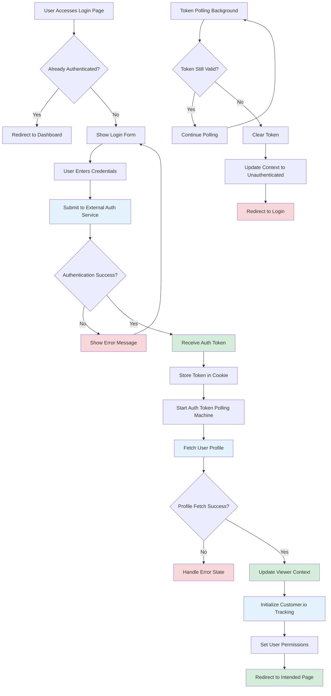

# Authentication Login Flow

## Description

Complete user authentication flow including login, token validation, and user session management.

## Key Files

- `src/utils/auth.ts`
- `src/context/viewer-context.tsx`
- `src/machines/auth-token-polling-machine.ts`
- `src/pages/login.tsx`

## Trigger Points

- User navigates to login page
- Authentication token expires
- Protected route access attempt

## Mermaid Diagram

## Decision Points

1. **Authentication Status Check**: Determines if user needs to login
2. **Credentials Validation**: External auth service validates credentials
3. **Profile Fetch**: Retrieves user profile data
4. **Token Validation**: Continuous polling to check token validity

## Error Paths

- Invalid credentials → Error message → Return to login form
- Profile fetch failure → Error state handling
- Token expiration → Automatic logout and redirect

## External Dependencies

- External authentication service (app.egghead.io)
- Customer.io for user identification
- Cookie storage for token persistence
