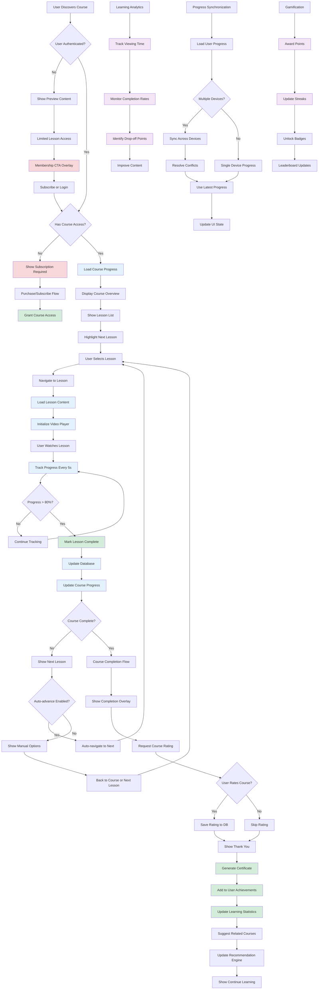

# Course Progression and Learning Flow

## Description

Complete learning experience including course enrollment, lesson progression, completion tracking, and certification.

## Key Files

- `src/components/pages/courses/[course]/index.tsx`
- `src/server/routers/progress.ts`
- `src/components/pages/lessons/lesson/index.tsx`
- `src/components/pages/user/components/continue-learning.tsx`

## Trigger Points

- Course enrollment or access
- Lesson completion
- Progress tracking updates
- Course completion

## Mermaid Diagram



## Learning Path Stages

### 1. Discovery & Access

- Course catalog browsing
- Search and filtering
- Preview content access
- Subscription requirement checks

### 2. Enrollment & Setup

- Access verification
- Progress initialization
- User preference setup
- Learning path creation

### 3. Active Learning

- Lesson-by-lesson progression
- Video playback and controls
- Progress tracking and persistence
- Note-taking and bookmarking

### 4. Completion & Recognition

- Automatic completion detection
- Certificate generation
- Achievement unlocking
- Progress celebration

### 5. Continued Learning

- Related course recommendations
- Learning path suggestions
- Skill development tracking
- Community engagement

## Progress Tracking Features

### Granular Progress

- Video watch time and percentage
- Lesson completion status
- Module completion tracking
- Overall course progress

### Cross-Device Sync

- Cloud-based progress storage
- Real-time synchronization
- Conflict resolution
- Offline progress caching

### Analytics Integration

- Learning velocity tracking
- Engagement pattern analysis
- Drop-off point identification
- Success metric calculation

## User Experience Optimizations

### Adaptive Learning

- Personalized lesson recommendations
- Difficulty-based content filtering
- Learning style adaptations
- Pacing recommendations

### Engagement Features

- Progress visualizations
- Achievement notifications
- Social sharing options
- Learning streaks

### Accessibility

- Closed caption support
- Variable playback speeds
- Keyboard navigation
- Screen reader compatibility

## Data Persistence

### Progress Storage

```sql
-- User lesson progress
user_lesson_progress (
  user_id,
  lesson_id,
  completed_at,
  watch_time,
  percentage_complete
)

-- Course completion
user_course_completion (
  user_id,
  course_id,
  completed_at,
  certificate_id,
  rating
)
```

### Caching Strategy

- Browser local storage for immediate updates
- Database persistence for reliability
- CDN caching for course metadata
- Real-time sync for multi-device support

## Integration Points

### External Services

- **Video Platform**: Mux for video delivery
- **Analytics**: PostHog for learning analytics
- **CRM**: Customer.io for learning milestones
- **Certificates**: Automated certificate generation

### Internal Systems

- **User Management**: Authentication and permissions
- **Content Management**: Course and lesson metadata
- **Recommendation Engine**: Personalized suggestions
- **Notification System**: Achievement and progress alerts
