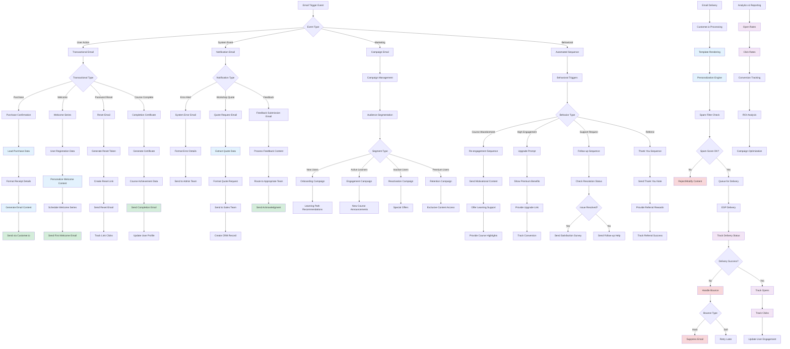

# Email Automation and Communication Flow

## Description

Comprehensive email system including transactional emails, marketing automation, and user communication workflows.

## Key Files

- `src/inngest/functions/send-feedback-email.ts`
- `src/inngest/functions/send-workshop-quote-email.ts`
- `src/inngest/functions/send-specific-product-email.ts`
- `src/lib/customer-io.ts`
- `src/components/forms/newsletter-signup.tsx`

## Trigger Points

- User actions (signup, purchase, completion)
- System events (errors, notifications)
- Scheduled campaigns
- Behavioral triggers

## Mermaid Diagram



## Email Categories

### 1. Transactional Emails

- **Purchase Confirmations**: Instant purchase receipts
- **Welcome Series**: Multi-step onboarding sequence
- **Password Resets**: Secure account recovery
- **Course Completions**: Achievement notifications
- **Account Updates**: Profile change confirmations

### 2. System Notifications

- **Error Alerts**: Critical system issue notifications
- **Workshop Quotes**: Team training inquiries
- **Feedback Submissions**: User feedback processing
- **Admin Alerts**: Internal team notifications

### 3. Marketing Campaigns

- **Product Announcements**: New course launches
- **Feature Updates**: Platform improvements
- **Special Offers**: Limited-time promotions
- **Content Recommendations**: Personalized suggestions

### 4. Behavioral Automation

- **Engagement Sequences**: Based on user activity
- **Abandonment Recovery**: Re-engage inactive users
- **Upsell Campaigns**: Encourage premium upgrades
- **Referral Programs**: Reward user referrals

## Email Template System

### Template Management

```typescript
// Email template structure
interface EmailTemplate {
  id: string
  name: string
  subject: string
  htmlContent: string
  textContent: string
  variables: string[]
  category: 'transactional' | 'marketing' | 'system'
}
```

### Personalization Engine

- Dynamic content insertion
- User preference respect
- Geographic customization
- Language localization
- Behavioral targeting

### A/B Testing

- Subject line optimization
- Content variant testing
- Send time optimization
- Template design testing
- Call-to-action testing

## Delivery Infrastructure

### Customer.io Integration

- Event-based triggering
- Advanced segmentation
- Delivery timing optimization
- Performance analytics
- Compliance management

### Email Service Providers

- Multiple ESP support for reliability
- Automatic failover mechanisms
- IP warming strategies
- Reputation management
- Deliverability optimization

### Queue Management

- Priority-based sending
- Rate limiting per ESP
- Retry logic for failures
- Dead letter queue handling
- Bulk operation optimization

## Compliance & Privacy

### GDPR Compliance

- Explicit consent tracking
- Easy unsubscribe mechanisms
- Data retention policies
- Right to deletion
- Privacy policy integration

### CAN-SPAM Compliance

- Clear sender identification
- Honest subject lines
- Physical address inclusion
- Unsubscribe link requirements
- Opt-out processing

### Security Measures

- Email authentication (SPF, DKIM, DMARC)
- Encryption in transit
- Secure token generation
- Anti-phishing protection
- Content sanitization

## Performance Monitoring

### Delivery Metrics

- **Delivery Rate**: Successfully delivered emails
- **Bounce Rate**: Hard and soft bounces
- **Spam Complaints**: User-reported spam
- **Unsubscribe Rate**: Opt-out frequency

### Engagement Metrics

- **Open Rate**: Email opens and unique opens
- **Click Rate**: Link clicks and click-to-open rate
- **Conversion Rate**: Goal completions from emails
- **Revenue Attribution**: Purchase tracking

### Optimization Strategies

- **Send Time Optimization**: Best delivery windows
- **Frequency Capping**: Prevent email fatigue
- **Content Optimization**: Improve engagement
- **List Hygiene**: Remove inactive subscribers

## Error Handling & Recovery

### Bounce Management

- Automatic hard bounce suppression
- Soft bounce retry logic
- Invalid email cleanup
- Engagement-based scoring

### Delivery Failures

- ESP failover mechanisms
- Queue replay capabilities
- Manual resend options
- Issue escalation alerts

### Content Issues

- Spam filter testing
- Link validation
- Image optimization
- Mobile compatibility
