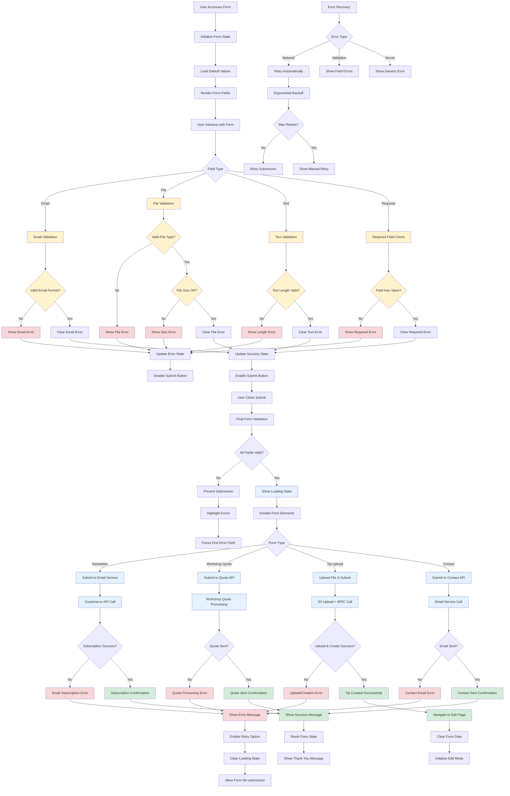

# Form Submission and Validation Flow

## Description

Comprehensive form handling including validation, submission, error handling, and success feedback across all form types.

## Key Files

- `src/components/forms/generic-newsletter-signup.tsx`
- `src/components/workshop/claude-code/contact-form.tsx`
- `src/components/tips/tip-uploader.tsx`
- `src/components/customer-io/email-entry-form.tsx`

## Trigger Points

- User form interaction and submission
- Client-side and server-side validation
- API communication
- Success and error handling

## Mermaid Diagram



## Form Types & Validation Rules

### 1. Newsletter Signup

- **Email Validation**: Format and deliverability
- **Honeypot Field**: Spam prevention
- **Rate Limiting**: Prevent abuse
- **Double Opt-in**: Confirmation required

### 2. Workshop Quote Request

- **Required Fields**: Name, email, company, participants
- **Email Format**: Business email preferred
- **Participant Count**: Numeric validation
- **Message Length**: Character limits
- **Timeline**: Date format validation

### 3. Tip Upload Form

- **File Upload**: Video format and size limits
- **Title**: Required, length validation
- **Description**: Optional, length limits
- **Tags**: Format and quantity validation
- **Privacy**: Public/private selection

### 4. Contact Forms

- **Name**: Required, length limits
- **Email**: Format validation
- **Subject**: Required, predefined options
- **Message**: Required, character limits
- **Category**: Dropdown selection

## Validation Strategies

### Client-Side Validation

```typescript
// Real-time field validation
const validateEmail = (email: string) => {
  const regex = /^[^\s@]+@[^\s@]+\.[^\s@]+$/
  return regex.test(email)
}

// Form state management
const [errors, setErrors] = useState({})
const [isValid, setIsValid] = useState(false)
```

### Server-Side Validation

```typescript
// Zod schema validation
const workshopQuoteSchema = z.object({
  name: z.string().min(2).max(100),
  email: z.string().email(),
  company: z.string().min(2).max(200),
  participants: z.number().min(1).max(1000),
})
```

### Progressive Enhancement

- Form works without JavaScript
- Enhanced UX with JS enabled
- Graceful degradation
- Accessibility compliance

## Error Handling Patterns

### User-Friendly Messages

- Clear, actionable error descriptions
- Specific field-level feedback
- Helpful suggestions for corrections
- Consistent error styling

### Recovery Mechanisms

- Automatic retry for transient errors
- Manual retry buttons for user control
- Form state preservation during errors
- Progressive error disclosure

### Logging & Monitoring

- Client-side error tracking
- Server-side validation failures
- Submission success rates
- User abandonment analytics

## Success Flow Optimization

### Immediate Feedback

- Loading states during submission
- Progress indicators for uploads
- Real-time validation feedback
- Success animations and messages

### Post-Submission Actions

- Appropriate page redirections
- Thank you message display
- Email confirmation sending
- Analytics event tracking

### User Retention

- Related content suggestions
- Newsletter subscription prompts
- Social sharing opportunities
- Account creation incentives

## Security Considerations

### Input Sanitization

- XSS prevention in all text fields
- File type validation for uploads
- SQL injection prevention
- CSRF token validation

### Rate Limiting

- Per-IP submission limits
- Per-user submission quotas
- Honeypot field detection
- CAPTCHA for suspicious activity

### Data Protection

- PII handling compliance
- Secure data transmission
- Minimal data collection
- User consent management
