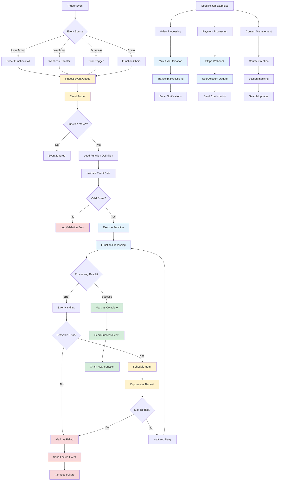

# Inngest Background Jobs Processing Flow

## Description

Event-driven background job processing using Inngest for reliable, scalable async operations.

## Key Files

- `src/inngest/inngest.server.ts`
- `src/inngest/inngest.config.ts`
- Various function files in `src/inngest/functions/`
- `src/app/api/inngest/route.ts`

## Trigger Points

- Webhook events from external services
- User actions requiring async processing
- Scheduled/cron-based operations
- Error retry mechanisms

## Mermaid Diagram



## Job Categories

### 1. Video Processing Jobs

- **video-uploaded**: Initial video processing orchestration
- **mux-webhooks-handlers**: Mux video processing events
- **transcript-ready**: Speech-to-text processing completion
- **tip-video-uploaded**: Tip-specific video processing

### 2. Payment & Subscription Jobs

- **stripe-webhook-handlers**: Payment event processing
- **lifetime-purchase**: Lifetime membership setup
- **specific-product-purchase**: Course/workshop access grants

### 3. Communication Jobs

- **send-feedback-email**: User feedback processing
- **send-workshop-quote-email**: Workshop inquiry responses
- **send-slack-message**: Internal team notifications
- **identify-customer-io**: User tracking and segmentation

### 4. Content Management Jobs

- **create-course**: Course creation workflow
- **index-lessons**: Search index maintenance
- **handle-transloadit-notification**: File processing results

## Error Handling Strategy

### Retry Logic

- **Exponential Backoff**: Increasing delays between retries
- **Max Attempts**: Configurable retry limits per job type
- **Selective Retry**: Different strategies for different error types
- **Dead Letter Queue**: Failed jobs for manual review

### Error Types

- **Transient**: Network timeouts, rate limits (retry)
- **Permanent**: Invalid data, authorization failures (no retry)
- **Resource**: Database locks, service unavailable (retry with backoff)

## Event Flow Patterns

### 1. Simple Job

```
Trigger Event → Function Execution → Success/Failure
```

### 2. Chain Pattern

```
Job A → Success Event → Job B → Success Event → Job C
```

### 3. Fan-out Pattern

```
Single Event → Multiple Parallel Jobs → Aggregation Job
```

### 4. Conditional Flow

```
Event → Job A → Condition Check → Job B or Job C
```

## Monitoring & Observability

### Built-in Features

- **Execution Logs**: Detailed job execution history
- **Performance Metrics**: Execution time and success rates
- **Error Tracking**: Failed job analysis and alerting
- **Event Replay**: Ability to replay failed events

### Custom Tracking

- **Honeycomb Integration**: Distributed tracing
- **PostHog Analytics**: Job completion metrics
- **Slack Alerts**: Critical failure notifications

## Configuration & Deployment

### Environment Setup

- **Development**: Local Inngest dev server
- **Staging**: Inngest cloud with staging config
- **Production**: Inngest cloud with production config

### Function Registration

- All functions exported from `src/inngest/functions/`
- Automatic discovery and registration
- Type-safe event definitions

## Security Considerations

### Event Validation

- **Webhook Signatures**: Verify event authenticity
- **Schema Validation**: Ensure event data integrity
- **Rate Limiting**: Prevent abuse and DoS attacks

### Data Handling

- **Sensitive Data**: Avoid logging sensitive information
- **Encryption**: Encrypt sensitive job payloads
- **Access Control**: Function-level authorization

## Performance Optimizations

### Concurrency

- **Parallel Execution**: Multiple jobs can run simultaneously
- **Resource Limits**: Prevent resource exhaustion
- **Queue Prioritization**: Critical jobs get priority

### Efficiency

- **Batch Processing**: Group similar operations
- **Caching**: Avoid redundant API calls
- **Database Pooling**: Efficient database connections
