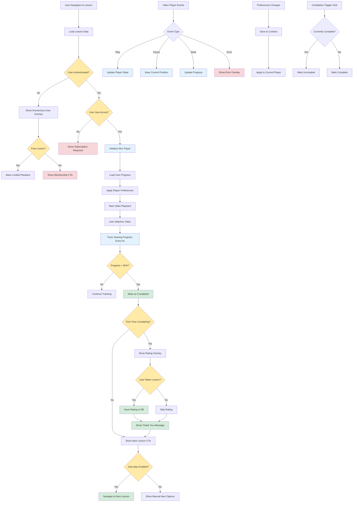

# Lesson Video Playback Flow

## Description

Complete user experience for watching lesson videos including progress tracking, overlays, and completion.

## Key Files

- `src/components/pages/lessons/lesson/index.tsx`
- `src/hooks/mux/use-mux-player.tsx`
- `src/components/pages/lessons/overlays.tsx`
- `src/machines/lesson-machine.ts`
- `src/server/routers/progress.ts`

## Trigger Points

- User navigates to lesson page
- Video play/pause actions
- Video completion
- Progress tracking updates

## Mermaid Diagram

## Decision Points

1. **Authentication Check**: Determines access level and available features
2. **Access Rights**: Checks subscription/membership status
3. **Free Content**: Some lessons available without subscription
4. **Progress Threshold**: 80% completion triggers completion state
5. **First Completion**: Shows rating overlay only once
6. **Auto-play Setting**: Controls automatic progression

## Error Paths

- Authentication failure → Anonymous overlay → Limited access
- No subscription → Membership CTA → Upgrade prompt
- Video load error → Error overlay → Retry options
- Progress save failure → Silent retry → Eventually consistent

## State Management

- **Lesson Machine**: Complex state transitions for playback lifecycle
- **Player Preferences**: Persisted in cookies across sessions
- **Progress Tracking**: Real-time updates to database
- **Overlay Management**: Context-aware overlay display

## External Dependencies

- Mux for video hosting and playback
- tRPC for progress tracking API
- Cookie storage for user preferences
- Database for completion status
