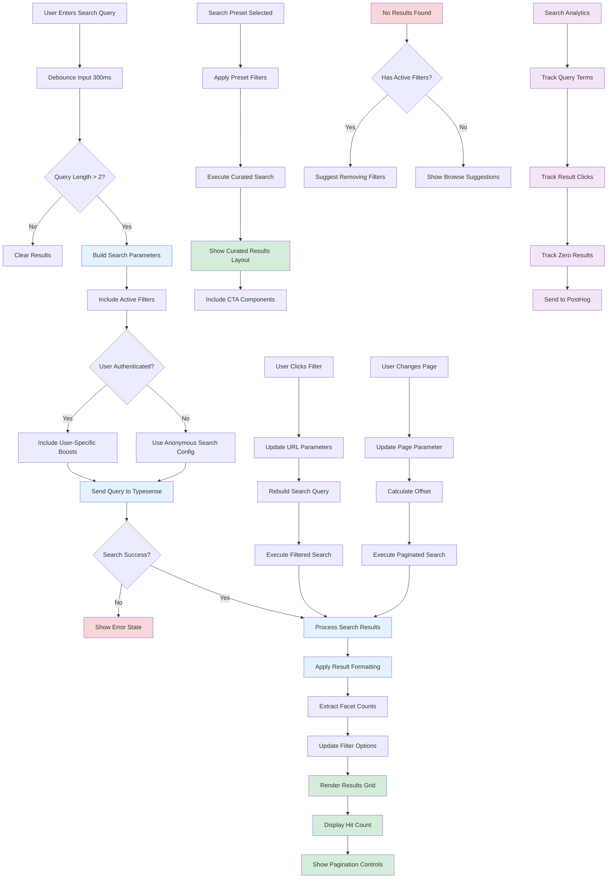

# Search Functionality Flow

## Description

Complete search experience including query processing, results display, filtering, and pagination.

## Key Files

- `src/components/search/index.tsx`
- `src/lib/search.ts`
- `src/utils/typesense.ts`
- `src/components/search/search-box.tsx`
- `src/components/search/hits.tsx`

## Trigger Points

- User types in search box
- Filter selection changes
- Pagination navigation
- Search preset selection

## Mermaid Diagram

## Decision Points

1. **Query Length**: Minimum 3 characters to prevent excessive API calls
2. **Authentication Status**: Affects search result ranking and personalization
3. **Search Success**: Handles API failures gracefully
4. **Result Count**: Determines pagination display
5. **Active Filters**: Changes search behavior and suggestions
6. **Result Type**: Different layouts for different content types

## Error Paths

- API failure → Error state → Retry option
- Network timeout → Loading state → Automatic retry
- Zero results → Helpful suggestions → Browse alternatives
- Invalid query → Sanitization → Safe search execution

## Search Features

- **Real-time search**: As-you-type with debouncing
- **Faceted search**: Filter by type, difficulty, instructor
- **Personalization**: Boost results based on user preferences
- **Autocomplete**: Query suggestions and recent searches
- **Analytics**: Comprehensive search behavior tracking

## URL State Management

- Query parameters synchronized with search state
- Browser back/forward navigation support
- Shareable search URLs
- Filter state persistence

## Search Index Structure

- Content types: courses, lessons, podcasts, talks, tips
- Searchable fields: title, description, tags, instructor
- Facet fields: type, difficulty, duration, instructor
- Ranking factors: popularity, recency, user engagement

## Performance Optimizations

- Request debouncing to reduce API calls
- Result caching for repeated queries
- Lazy loading of result images
- Virtual scrolling for large result sets

## External Dependencies

- Typesense for search indexing and querying
- PostHog for search analytics
- Image CDN for result thumbnails
- Authentication service for personalization
