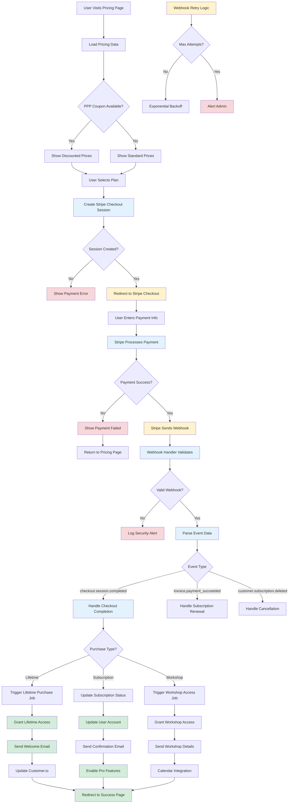

# Stripe Payment Processing Flow

## Description

Complete payment processing pipeline including checkout, webhooks, and post-purchase automation.

## Key Files

- `src/server/routers/stripe.ts`
- `src/inngest/functions/stripe-webhook-handlers.ts`
- `src/inngest/functions/lifetime-purchase.ts`
- `src/components/pricing/pricing-widget/index.tsx`
- `src/app/api/stripe/webhook/route.ts`

## Trigger Points

- User selects pricing plan
- Checkout completion
- Stripe webhook events
- Subscription changes

## Mermaid Diagram

## Decision Points

1. **PPP Eligibility**: Purchasing Power Parity discount availability
2. **Session Creation**: Stripe checkout session initialization
3. **Payment Processing**: Stripe handles payment validation
4. **Webhook Validation**: Security check for authentic webhooks
5. **Purchase Type**: Different flows for different product types
6. **Retry Logic**: Handles webhook delivery failures

## Error Paths

- Session creation failure → Payment error → Return to pricing
- Payment failure → User notification → Retry option
- Invalid webhook → Security logging → No processing
- Processing failure → Automatic retry → Admin alert if persistent

## Async Background Jobs

- `stripe-webhook-handlers`: Main webhook processing orchestrator
- `lifetime-purchase`: Handles lifetime membership setup
- `specific-product-purchase`: Manages workshop and course access
- Email sending jobs for confirmations and receipts

## External Dependencies

- Stripe for payment processing and checkout
- Customer.io for email automation
- Internal user management system
- Workshop scheduling system (for workshop purchases)

## Security Considerations

- Webhook signature verification
- Idempotency key handling
- Sensitive data logging restrictions
- PCI compliance for payment data
