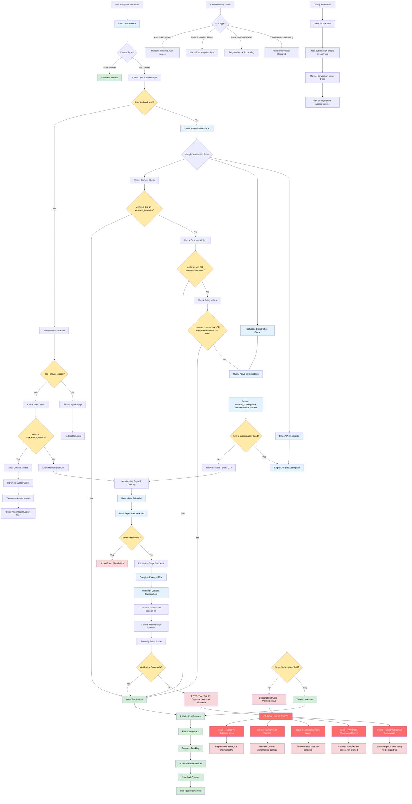

# Subscription Access Control and Content Gating Flow

## Description

Comprehensive flow documenting pro vs free subscriber access control, content gating mechanisms, and potential failure points in the subscription verification system.

## Key Files

- `src/utils/is-member.ts` - Core membership verification logic
- `src/pages/api/users/check-pro-status.ts` - API endpoint for pro status validation
- `src/lib/subscriptions.ts` - Subscription database queries
- `src/components/pages/lessons/lesson/index.tsx` - Lesson access control logic
- `src/machines/lesson-machine.ts` - Lesson state machine with access states
- `src/components/pages/lessons/overlays.tsx` - Access control overlays
- `src/server/ability.ts` - Permission-based access control
  src/utils/is-member.ts,src/pages/api/users/check-pro-status.ts,src/lib/subscriptions.ts,src/components/pages/lessons/lesson/index.tsx,src/machines/lesson-machine.ts,src/components/pages/lessons/overlays.tsx,src/server/ability.ts

## Trigger Points

- User navigates to lesson page
- Lesson video completion
- Subscription status changes
- Session verification checks

## Mermaid Diagram



## Critical Access Control Decision Points

### 1. **Primary Authentication Check**

- **Location**: `src/pages/lessons/[slug].tsx:276-290`
- **Logic**: Multiple authentication sources checked in sequence
- **Issue**: Inconsistent results from different auth sources

### 2. **Membership Verification Logic**

- **Location**: `src/utils/is-member.ts:1-9`
- **Code**:

```typescript
export function isMember(viewer: any, customer?: any) {
  return (
    (customer &&
      (customer.pro ||
        customer.instructor ||
        [customer.instructor, customer.pro].includes('true'))) ||
    (viewer && (viewer.is_pro || viewer.is_instructor))
  )
}
```

- **Issues**:
  - String `'true'` vs boolean `true` comparison
  - Multiple possible auth sources that may conflict
  - Customer object may be undefined or inconsistent

### 3. **Database Subscription Query**

- **Location**: `src/lib/subscriptions.ts:27-42`
- **Critical SQL Query**:

```sql
select account_subscriptions.stripe_subscription_id,
       accounts.stripe_customer_id,
       users.email, users.id, accounts.id
from users
join account_users ON account_users.user_id = users.id
join accounts on accounts.id = account_users.account_id
join account_subscriptions on accounts.id = account_subscriptions.account_id
where users.email = lower('${email}')
and account_subscriptions.status = 'active'
and account_subscriptions.stripe_subscription_id not like '%sub_gift_not_in_stripe%'
```

- **Issues**:
  - Complex JOIN may fail if relationships are broken
  - Email-based lookup may not match current user
  - Status field may not be updated in real-time

### 4. **Stripe API Verification**

- **Location**: `src/lib/subscriptions.ts:82-88`
- **Process**: Query Stripe API for subscription status
- **Issues**:
  - Network failures cause access denial
  - Stripe data may be newer than local database
  - Rate limiting can block verification

## Content Access Levels

### Free Users (Anonymous)

- **MAX_FREE_VIEWS = 4** videos total
- **Cookie-based tracking**: `egghead-watch-count`
- **After limit**: Membership CTA overlay
- **Access**: Limited video playback, no downloads, no notes

### Free Users (Authenticated)

- **Same limits** as anonymous users
- **Additional**: Profile tracking, progress saving
- **Conversion Flow**: Email capture → Pro upgrade prompts

### Pro Subscribers

- **Full access** to all pro content
- **Features**: Downloads, notes, full transcripts, unlimited viewing
- **Progress tracking** across devices
- **Priority support** access

### Instructors

- **Same access** as Pro subscribers
- **Additional**: Content upload permissions
- **Course creation** capabilities
- **Revenue sharing** access

## Identified Issues and Debugging Points

### Issue 1: Authentication Source Conflicts

**Problem**: Multiple auth sources (`viewer`, `customer`, `database`) may return different results
**Debug Steps**:

1. Check `viewer.is_pro` vs `customer.pro` in browser console
2. Verify database subscription status matches Stripe
3. Check authentication token validity

### Issue 2: String vs Boolean Comparison

**Problem**: `customer.pro` may be string `'true'` instead of boolean `true`
**Location**: `src/utils/is-member.ts:6`
**Fix Needed**: Normalize boolean values before comparison

### Issue 3: Database Synchronization Delays

**Problem**: Stripe webhook may not have updated local database yet
**Symptoms**: Payment succeeded but access still denied
**Debug**: Check webhook processing logs and retry mechanisms

### Issue 4: Session Persistence Issues

**Problem**: Authentication state not properly maintained across page loads
**Check**: Cookie expiration, token refresh logic, CORS settings

### Issue 5: Email Case Sensitivity

**Problem**: Database query uses `lower('${email}')` but user input may vary
**Check**: Email normalization consistency across all verification points

## Debugging Checklist

### For Users Reporting Access Issues:

1. **Check subscription status in Stripe dashboard**
2. **Verify email address matches subscription**
3. **Check database for active subscription record**
4. **Validate authentication token is not expired**
5. **Review webhook processing logs for recent payments**
6. **Compare `viewer` object vs `customer` object values**
7. **Test with browser dev tools to inspect auth cookies**

### For Developers:

1. **Monitor conversion funnel drop-offs at each decision point**
2. **Set up alerts for subscription verification failures**
3. **Track analytics for access denial vs payment completion gaps**
4. **Log all subscription check results for debugging**
5. **Implement health checks for Stripe API connectivity**

## Recommended Improvements

### 1. **Consolidate Auth Sources**

- Single source of truth for subscription status
- Consistent boolean typing across all auth objects
- Real-time synchronization between Stripe and database

### 2. **Enhanced Error Handling**

- Specific error messages for different failure types
- Automatic retry mechanisms for transient failures
- User-friendly recovery options

### 3. **Improved Monitoring**

- Real-time alerts for payment vs access mismatches
- Conversion funnel analytics
- Subscription verification success rates

### 4. **Debugging Tools**

- Admin panel for subscription status debugging
- User-facing subscription status page
- Automated health checks for auth flow

This flow diagram captures the complex subscription verification system and highlights the critical points where issues may occur in the pro vs free content gating process.
