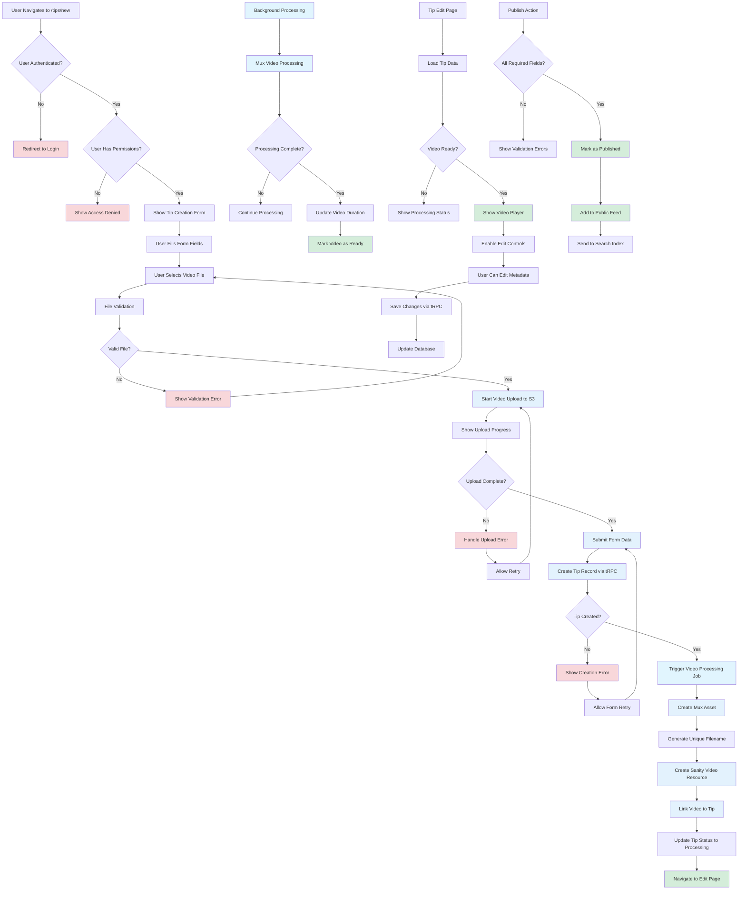

# Tip Creation and Management Flow

## Description

Complete workflow for creating, uploading, and managing video tips including form submission, video processing, and publication.

## Key Files

- `src/components/tips/tip-uploader.tsx`
- `src/module-builder/create-tip-form.tsx`
- `src/server/routers/tips.ts`
- `src/inngest/functions/tip-video-uploaded.ts`
- `src/pages/tips/new/page.tsx`

## Trigger Points

- User navigates to tip creation page
- Form submission with video
- Video upload completion
- Tip publication

## Mermaid Diagram

## Decision Points

1. **Authentication Check**: Only logged-in users can create tips
2. **Permission Validation**: User must have tip creation permissions
3. **File Validation**: Video file type, size, and format checks
4. **Upload Success**: Determines if form processing can continue
5. **Creation Success**: Database record creation validation
6. **Processing Completion**: Video must be ready before publishing
7. **Publication Requirements**: All metadata fields must be complete

## Error Paths

- No authentication → Login redirect → Return to creation
- No permissions → Access denied message
- Invalid file → Validation error → File reselection
- Upload failure → Error message → Retry option
- Creation failure → Form error → Retry submission
- Processing failure → Admin notification → Manual review

## Form State Management

- File upload progress tracking
- Form validation state
- Submit button states
- Error message display
- Success feedback

## Background Processing

- Video upload to S3 storage
- Mux asset creation and processing
- Sanity CMS record creation
- Database relationship establishment
- Search index updates

## tRPC Mutations

- `tips.create` - Initial tip creation
- `tips.update` - Metadata updates
- `tips.publish` - Publishing state change
- `tips.delete` - Tip removal (if permitted)

## External Dependencies

- AWS S3 for video file storage
- Mux for video processing and hosting
- Sanity CMS for video metadata
- Search indexing service (Typesense)
- File type validation libraries
