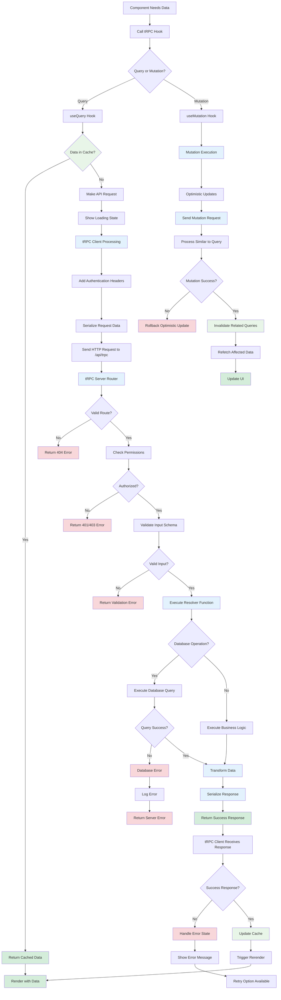

# tRPC API Communication Flow

## Description

Type-safe API communication between client and server using tRPC, including query management, caching, and error handling.

## Key Files

- `src/server/routers/_app.ts`
- `src/app/_trpc/client.ts`
- `src/app/_trpc/Provider.tsx`
- `src/server/trpc.ts`
- Various router files in `src/server/routers/`

## Trigger Points

- Component mounts requiring data
- User interactions triggering mutations
- Data invalidation and refetching
- Real-time updates

## Mermaid Diagram

## Decision Points

1. **Query vs Mutation**: Different handling for read vs write operations
2. **Cache Hit**: Determines if network request is needed
3. **Route Validation**: Ensures requested endpoint exists
4. **Authorization**: Checks user permissions for operation
5. **Input Validation**: Zod schema validation on input data
6. **Database Success**: Handles database operation outcomes
7. **Response Processing**: Success vs error response handling

## Error Paths

- Invalid route → 404 error → Error boundary
- Unauthorized access → 401/403 error → Login redirect
- Validation failure → Client-side error → Form feedback
- Database error → Server error → Retry mechanism
- Network failure → Network error → Offline handling

## Caching Strategy

- **React Query Integration**: Automatic request deduplication
- **Cache Invalidation**: Intelligent cache updates after mutations
- **Background Refetching**: Stale-while-revalidate pattern
- **Optimistic Updates**: Immediate UI feedback for mutations

## Type Safety Features

- **End-to-End Types**: TypeScript types flow from server to client
- **Runtime Validation**: Zod schemas ensure data integrity
- **IDE Support**: Full autocomplete and type checking
- **Compile-time Errors**: Type mismatches caught during build

## Router Organization

- `course.ts` - Course-related operations
- `lesson.ts` - Lesson management
- `tips.ts` - Tip creation and management
- `progress.ts` - Learning progress tracking
- `stripe.ts` - Payment and subscription operations
- `user.ts` - User profile and preferences

## Performance Optimizations

- Request deduplication for identical queries
- Automatic background refetching
- Selective field querying
- Response compression
- Connection pooling for database operations

## External Dependencies

- React Query for client-side state management
- Zod for schema validation
- Database connection pooling
- Authentication service integration
