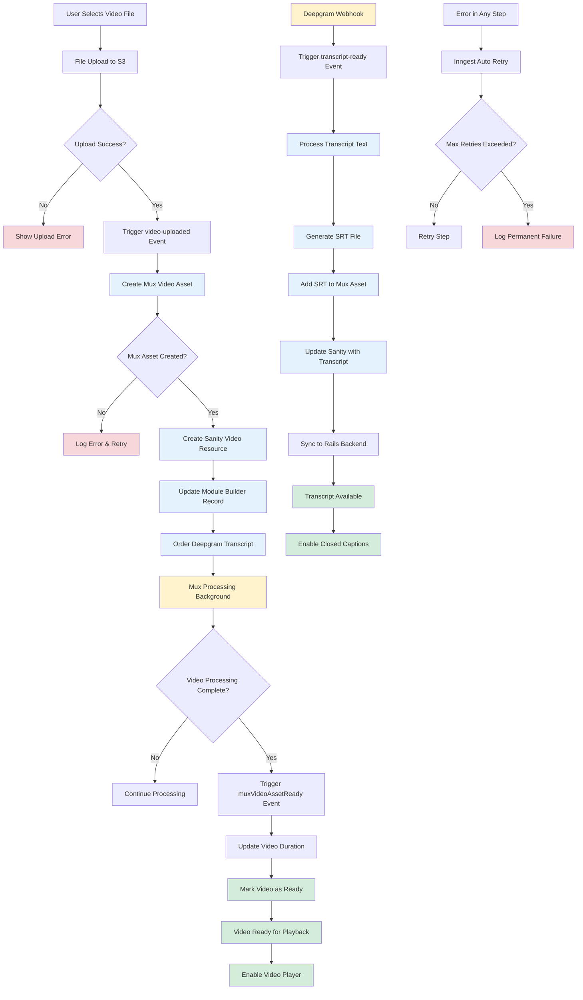

# Video Upload and Processing Flow

## Description

Complete pipeline for video file upload, processing, transcription, and content management.

## Key Files

- `src/inngest/functions/video-uploaded.ts`
- `src/inngest/functions/mux/mux-webhooks-handlers.ts`
- `src/inngest/functions/transcript-ready.ts`
- `src/components/upload/video-uploader.tsx`
- `src/lib/mux.ts`

## Trigger Points

- User uploads video file in tip creator
- Course lesson video upload
- Video processing completion webhooks

## Mermaid Diagram

## Decision Points

1. **File Upload Success**: Determines if processing can begin
2. **Mux Asset Creation**: Critical for video processing pipeline
3. **Processing Completion**: Triggers duration update and availability
4. **Transcript Generation**: Enables accessibility features
5. **Retry Logic**: Handles transient failures with exponential backoff

## Error Paths

- Upload failure → User notification → Retry upload
- Mux asset creation failure → Log error → Inngest retry
- Processing failure → Auto retry up to max attempts
- Transcript failure → Video still available but without captions

## External Dependencies

- AWS S3 for file storage
- Mux for video processing and hosting
- Deepgram for speech-to-text transcription
- Sanity CMS for metadata storage
- Rails backend for lesson management

## Async Background Jobs

- `video-uploaded`: Orchestrates initial processing
- `muxVideoAssetCreated`: Confirms asset creation
- `muxVideoAssetReady`: Handles completion
- `transcript-ready`: Processes transcription results
