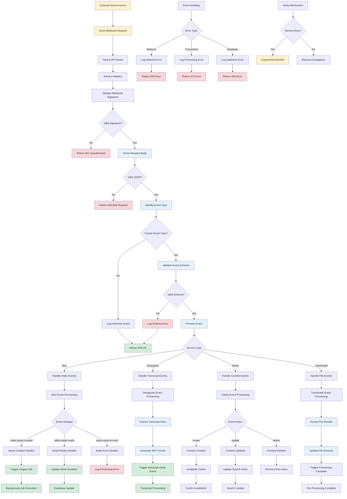

# Webhook Processing Flow

## Description

Comprehensive webhook handling from external services including validation, processing, and error handling.

## Key Files

- `src/app/api/mux/webhook/route.ts`
- `src/app/api/deepgram/webhook/route.ts`
- `src/app/api/webhooks/sanity/route.ts`
- `src/app/api/webhooks/transloadit/route.ts`
- `src/inngest/events/*.ts`

## Trigger Points

- External service events (Mux, Deepgram, Sanity, Transloadit)
- Webhook signature validation
- Event processing and routing
- Error handling and retries

## Mermaid Diagram



## Webhook Sources

### 1. Mux Webhooks

- **video.asset.created**: Video asset creation confirmation
- **video.asset.ready**: Video processing completion
- **video.asset.errored**: Video processing failure
- **video.upload.asset.created**: Upload completion

### 2. Deepgram Webhooks

- **transcript.completed**: Speech-to-text processing complete
- **transcript.failed**: Transcription processing failure

### 3. Sanity Webhooks

- **create**: New content document created
- **update**: Existing content modified
- **delete**: Content document removed

### 4. Transloadit Webhooks

- **ASSEMBLY_COMPLETED**: File processing pipeline complete
- **ASSEMBLY_FAILED**: File processing pipeline failure

## Security Measures

### Signature Validation

```typescript
// Mux signature validation
const signature = headers.get('mux-signature')
const isValid = verifyMuxSignature(body, signature, secret)

// Deepgram validation
const token = headers.get('authorization')
const isValid = validateDeepgramToken(token)

// Sanity validation
const signature = headers.get('sanity-webhook-signature')
const isValid = verifySanitySignature(body, signature, secret)
```

### Rate Limiting

- Prevent webhook flooding attacks
- Per-service rate limits
- IP-based restrictions for known services

### Data Validation

- JSON schema validation for event payloads
- Required field presence checks
- Data type and format validation

## Error Handling Strategy

### Immediate Response

- Always return HTTP status to sender
- Log errors for debugging
- Never expose internal system details

### Retry Logic

- **Mux**: Built-in retry with exponential backoff
- **Deepgram**: Manual retry for critical failures
- **Sanity**: Cache invalidation can be retried
- **Transloadit**: File processing can be re-triggered

### Failure Recovery

- Dead letter queues for persistent failures
- Manual investigation tools
- Alert system for critical webhooks
- Data consistency checks

## Processing Patterns

### Immediate Processing

- Simple database updates
- Cache invalidation
- Status changes

### Async Processing

- Complex business logic
- External API calls
- File processing
- Email sending

### Event Chaining

- Webhook triggers Inngest job
- Job completion triggers next job
- Multi-step processing workflows

## Monitoring & Alerting

### Success Metrics

- Webhook reception rate
- Processing success rate
- Average processing time
- Event type distribution

### Error Tracking

- Failed webhook count
- Error type categorization
- Service-specific failure rates
- Recovery success rates

### Alerting Rules

- High error rate thresholds
- Critical service failures
- Unusual traffic patterns
- Processing delays
