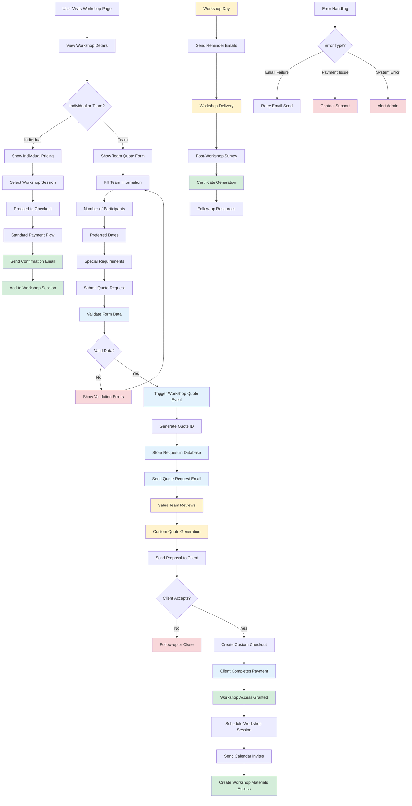

# Workshop Registration and Management Flow

## Description

Complete workshop registration process including quote requests, payment processing, and participant management.

## Key Files

- `src/components/workshop/claude-code/contact-form.tsx`
- `src/app/api/workshop-quote/route.ts`
- `src/inngest/functions/send-workshop-quote-email.ts`
- `src/components/pricing/select-plan-new/index.tsx`

## Trigger Points

- User submits workshop quote form
- Workshop payment completion
- Workshop session scheduling
- Email notifications

## Mermaid Diagram

## Decision Points

1. **Registration Type**: Individual vs team registration paths
2. **Form Validation**: Required fields and business rules
3. **Quote Acceptance**: Client decision on custom proposal
4. **Payment Completion**: Successful payment processing
5. **Workshop Scheduling**: Date and resource availability

## Error Paths

- Form validation failure → Error display → Form correction
- Email delivery failure → Automatic retry → Manual follow-up
- Payment processing error → Payment retry → Support contact
- Workshop scheduling conflict → Alternative dates → Resolution

## Quote Request Process

- Team size and requirements assessment
- Custom pricing calculation
- Sales team review and approval
- Personalized proposal generation
- Client negotiation and acceptance

## Workshop Delivery Flow

- Pre-workshop preparation and materials
- Participant onboarding and setup
- Live workshop session delivery
- Post-workshop resources and follow-up
- Certificate and completion tracking

## Email Automation

- Quote request confirmation
- Sales team notification
- Payment confirmation
- Workshop reminders and preparation
- Post-workshop follow-up

## External Dependencies

- Email delivery service for notifications
- Calendar integration for scheduling
- Payment processing via Stripe
- Workshop materials hosting
- Certificate generation system

## Data Tracking

- Quote conversion rates
- Workshop completion metrics
- Participant satisfaction scores
- Revenue and pricing analytics
