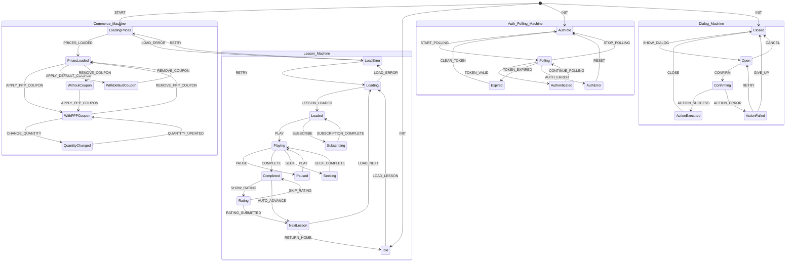

# XState Machine State Management Flow

## Description

Complex state management using XState machines for predictable state transitions and side effects.

## Key Files

- `src/machines/commerce-machine.ts`
- `src/machines/lesson-machine.ts`
- `src/machines/auth-token-polling-machine.ts`
- `src/machines/confirmation-dialog-machine.ts`

## Trigger Points

- User interactions requiring complex state logic
- Async operations with multiple states
- Multi-step workflows
- Complex UI state coordination

## Mermaid Diagram



## State Machine Benefits

### 1. Commerce Machine

- **Predictable Pricing**: Complex pricing logic with coupons and quantities
- **State Isolation**: Each pricing state handles specific scenarios
- **Side Effects**: API calls for price calculations
- **Guards**: Conditional transitions based on user eligibility

### 2. Lesson Machine

- **Playback Control**: Complex video player state management
- **Progress Tracking**: Automatic progress updates during playback
- **User Flow**: Guided experience through lesson completion
- **Error Recovery**: Graceful handling of playback failures

### 3. Auth Polling Machine

- **Token Management**: Continuous authentication state monitoring
- **Auto-refresh**: Proactive token renewal before expiration
- **Cleanup**: Proper cleanup on logout or errors
- **Resilience**: Network failure recovery

### 4. Confirmation Dialog Machine

- **User Confirmation**: Safe destructive actions with confirmation
- **Action Execution**: Async action handling with loading states
- **Error Handling**: Retry mechanisms for failed actions
- **Cancel Safety**: Clean cancellation without side effects

## Key Features

### State Transitions

- **Explicit**: All possible state changes are explicitly defined
- **Guarded**: Conditional logic controls when transitions occur
- **Atomic**: State changes happen atomically, preventing race conditions

### Side Effects

- **Services**: Long-running async operations (API calls, polling)
- **Actions**: Fire-and-forget effects (logging, analytics)
- **Guards**: Boolean conditions for transition control

### Error Handling

- **Error States**: Dedicated states for error scenarios
- **Recovery**: Built-in retry mechanisms
- **Graceful Degradation**: Fallback behaviors when things go wrong

## Integration with React

### Hook Usage

```typescript
const [state, send] = useMachine(commerceMachine)
const [lessonState, sendLesson] = useMachine(lessonMachine)
const [authState, sendAuth] = useMachine(authTokenPollingMachine)
```

### Event Handling

- User interactions send events to machines
- State changes trigger React re-renders
- Side effects handle external integrations

### State Queries

- `state.matches('loading')` - Check current state
- `state.context` - Access machine context data
- `state.can('PLAY')` - Check if event is allowed

## Testing Benefits

- **Predictable**: Known inputs produce known outputs
- **Comprehensive**: Test all possible state combinations
- **Visual**: State diagrams document expected behavior
- **Isolated**: Test state logic separately from UI
